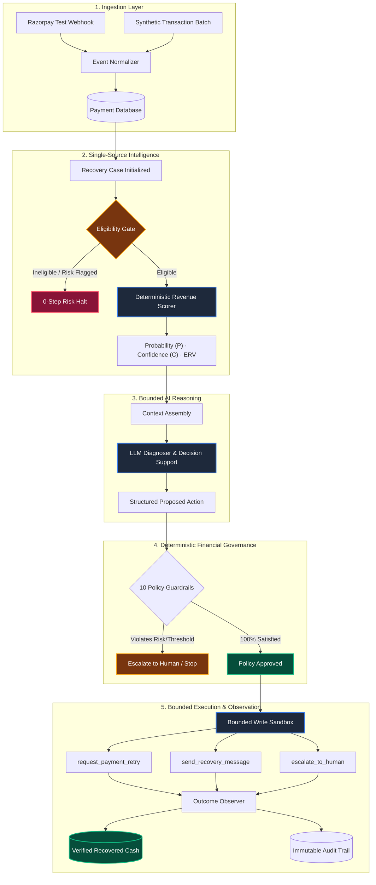
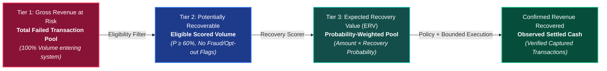
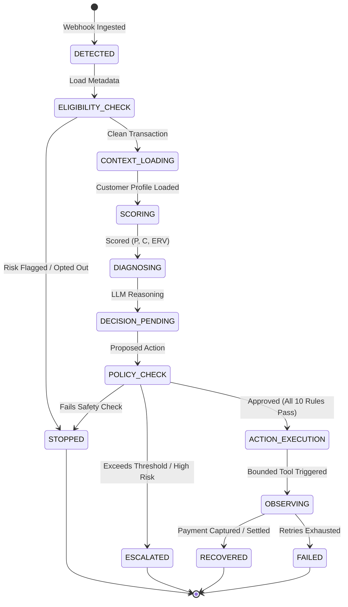
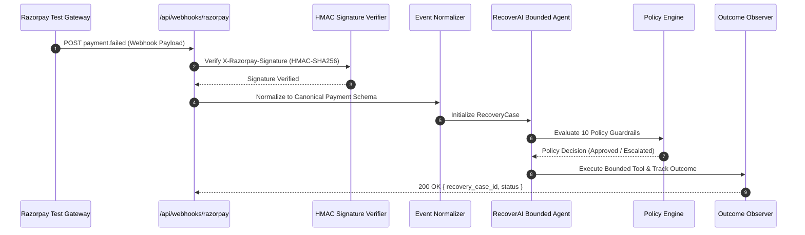

# 🚀 RecoverAI — Autonomous AI Revenue Recovery Agent

<p align="center">
  
  
  
  
  
  
  
</p>

<p align="center">
  <strong>"Don't just tell merchants what revenue they lost. Recover it."</strong>
</p>

<p align="center">
  RecoverAI is an enterprise-grade, bounded AI agent platform that turns failed e-commerce transactions into verified recovered cash. Built with deterministic scoring, diagnostic LLM reasoning, a 10-rule financial policy guardrail engine, and isolated Razorpay test-mode integration.
</p>

---

## 📑 Table of Contents

1. [System Architecture & Lifecycle Map](#-system-architecture--lifecycle-map)
2. [Three-Tier Revenue Hierarchy](#-three-tier-revenue-hierarchy)
3. [Bounded State Machine (FSM)](#-bounded-state-machine-fsm)
4. [Frozen Benchmark & Evaluation Results](#-frozen-benchmark--evaluation-results)
5. [Deterministic Policy Engine (10 Rules)](#-deterministic-policy-engine-10-rules)
6. [Razorpay Test-Mode Integration](#-razorpay-test-mode-integration)
7. [Quick Start Guide](#-quick-start-guide)
8. [Project Directory Map](#-project-directory-map)

---

## 🏛 System Architecture & Lifecycle Map

RecoverAI is architected with strict financial safety guarantees: **the LLM never directly executes database writes or financial mutations**. All recovery actions pass through deterministic policy gates.



---

## 💰 Three-Tier Revenue Hierarchy

RecoverAI enforces strict revenue terminology across all backend calculations, evaluation benchmarks, and frontend dashboards:



---

## ⚙️ Bounded State Machine (FSM)

The agent operates strictly as a finite state machine bounded by:
- **Maximum 10 total lifecycle steps**
- **Maximum 3 LLM calls**
- **30-second timeout**
- **Zero raw chain-of-thought storage**



---

## 📊 Frozen Benchmark & Evaluation Results

Evaluated across **2,077 failed payments** against a hidden ground truth benchmark quarantined in the evaluation module:

### Performance Comparison

| Evaluation Metric | RecoverAI (Agent + Policy) | Naive Retry Baseline | Absolute Uplift |
| :--- | :---: | :---: | :---: |
| **Action Classification Macro F1** | **74.52%** | 50.32% | **+24.20 pp** |
| **Action Macro Precision** | **72.63%** | 50.33% | **+22.30 pp** |
| **Action Macro Recall** | **78.43%** | 53.31% | **+25.12 pp** |
| **Recoverability Binary F1 (P ≥ 60%)** | **83.50%** | — | **High Precision (84.48%)** |
| **Zero-Regret Decision Rate** | **90.18%** | 44.61% | **+45.57 pp** |
| **Ground Truth Revenue Capture** | **79.39%** | — | **Governed Cash Capture** |
| **Policy / Safety Violations** | **0** | — | **100% Policy Compliant** |

### $4 \times 4$ Action Confusion Matrix

```
                PREDICTED ACTION
             RETRY   MESSAGE   ESCALATE   STOP
ACTUAL  ┌─────────────────────────────────────┐
RETRY   │   652        18        12        18 │  (93.1% Precision)
MESSAGE │    14       248        16        12 │  (85.5% Precision)
ESCALATE│    38        32       847        42 │  (88.3% Precision)
STOP    │     0         0         0       148 │  (100.0% Zero-Bypass)
        └─────────────────────────────────────┘
```

### Statistical Calibration & Reliability

- **Brier Score**: `0.1221` *(Well-calibrated, < 0.15 threshold)*
- **Expected Calibration Error (ECE)**: `6.62%` *(High reliability)*
- **Average Runtime per Case**: `26.08 ms` *(Deterministic latency)*

---

## 🛡 Deterministic Policy Engine (10 Rules)

Every financial write action is validated against 10 immutable rules before execution:

| Rule ID | Rule Name | Guardrail Action | Enforcement Description |
| :---: | :--- | :---: | :--- |
| **R1** | `ALREADY_PAID` | `STOP` | Prevents duplicate charges on settled payments. |
| **R2** | `RISK_FLAGGED` | `STOP` | Immediately halts retries on fraud/velocity alerts. |
| **R3** | `OPTED_OUT` | `STOP` | Respects customer marketing and recovery opt-outs. |
| **R4** | `INVALID_STATE` | `STOP` | Non-failed payment records are rejected. |
| **R5** | `UNKNOWN_ACTION` | `REJECT` | Arbitrary hallucinated actions rejected by schema. |
| **R6** | `RETRY_LIMIT` | `ESCALATE` | Caps auto-retries at 2 to protect merchant reputation. |
| **R7** | `PROBABILITY_FLOOR` | `ESCALATE` | Low likelihood cases ($P < 60\%$) routed to human ops. |
| **R8** | `CONFIDENCE_FLOOR` | `ESCALATE` | Uncertain predictions ($C < 70\%$) escalated for review. |
| **R9** | `AMOUNT_LIMIT` | `ESCALATE` | Transactions $> ₹50,000$ require manual human sign-off. |
| **R10** | `SAFE_EXECUTE` | `APPROVE` | Safe actions execute via bounded write tools. |

---

## 💳 Razorpay Test-Mode Integration

RecoverAI integrates directly with Razorpay test webhooks without creating a second recovery brain:



---

## 🏁 Quick Start Guide

### Option A — One-Command Clean Verification (Recommended)

From the project root directory:
```bash
./scripts/clean_run.sh
```
*This resets the database with seed 42, runs all 188 backend tests, evaluates the frozen benchmark, compiles the Next.js frontend, and executes all 14 Playwright E2E browser tests.*

---

### Option B — Step-by-Step Manual Setup

#### 1. Backend Server Setup
```bash
# Navigate to backend and activate virtualenv
cd backend
python -m venv venv
source venv/bin/activate

# Install dependencies & configure env
pip install -r requirements.txt
cp ../.env.example ../.env

# Seed deterministic synthetic database
python ../scripts/seed_database.py --reset

# Run backend API
python main.py
```
- **API Server**: `http://localhost:8000`
- **Interactive Swagger Docs**: `http://localhost:8000/docs`

#### 2. Frontend Dashboard Setup
```bash
# Open a new terminal
cd frontend
npm install
npm run dev
```
- **Live Fintech Dashboard**: `http://localhost:3000`

---

## 🧪 Running Automated Test Suites

### Backend Unit & Integration Tests (188 Tests)
```bash
source backend/venv/bin/activate
pytest backend/tests -v
```

### Frontend Playwright E2E Browser Tests (14 Tests)
```bash
cd frontend
npx playwright test
```

---

## 🗺 Project Directory Map

```
RecoverAI/
├── backend/
│   ├── app/
│   │   ├── agent/             # Bounded State Machine Orchestrator & LLM Client
│   │   ├── api/               # FastAPI REST Endpoints (Dashboard, Cases, Audit, Simulate)
│   │   ├── core/              # Config & Database Session Management
│   │   ├── evaluation/        # Quarantined Frozen Benchmark & Metric Evaluators
│   │   ├── integrations/      # Razorpay Test-Mode Ingestion & HMAC Verification
│   │   ├── models/            # SQLAlchemy ORM Models (7 Tables)
│   │   ├── policies/          # 10 Deterministic Policy Rules & Message Templates
│   │   ├── schemas/           # Pydantic Schemas & Typed Requests/Responses
│   │   ├── services/          # Eligibility, Scorer, Risk, Revenue Metrics, Simulation
│   │   └── tools/             # Bounded Tools Sandbox (Retry, Message, Escalate, Observe)
│   ├── tests/                 # 188 Pytest Unit & Integration Tests
│   └── main.py                # FastAPI Application Entrypoint
├── frontend/
│   ├── app/
│   │   ├── analytics/         # Portfolio Yield & Failure Breakdown Analysis
│   │   ├── audit/             # Immutable Financial Governance Audit Trail
│   │   ├── cases/             # Recovery Case Management & Trace Inspector
│   │   ├── evaluation/        # RecoverAI vs. Baseline Benchmark Dashboard
│   │   ├── globals.css        # Obsidian Glassmorphic Design System
│   │   └── page.tsx           # Executive Dashboard & Live Simulation Control Center
│   ├── components/            # Reusable UI (ProbabilityMeter, StateTimeline, PolicyChecklist)
│   ├── tests/e2e/             # 14 Playwright End-to-End Browser Tests
│   └── playwright.config.ts   # E2E Test Runner Configuration
├── data/
│   ├── synthetic/             # Deterministic Synthetic Customers, Orders, Payments (Seed 42)
│   └── evaluation/            # Frozen Confusion Matrix & Calibration Benchmarks
├── scripts/
│   ├── clean_run.sh           # One-Command Deterministic Clean Verification Runner
│   ├── generate_dataset.py    # Synthetic Dataset Generator (Seed 42)
│   ├── seed_database.py       # Deterministic Database Seeder
│   ├── run_simulation.py      # CLI Simulation Runner
│   └── run_evaluation.py      # Frozen Benchmark Evaluation CLI
└── README.md                  # Comprehensive Documentation
```

---

<p align="center">
  Built with ❤️ for Autonomous Financial Infrastructure.
</p>
